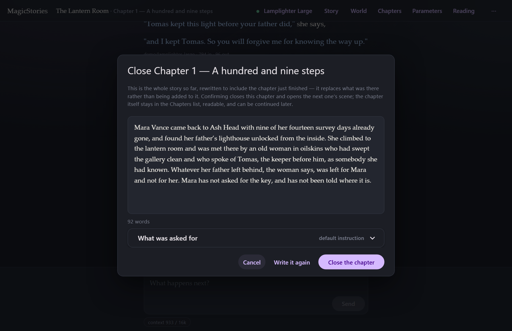
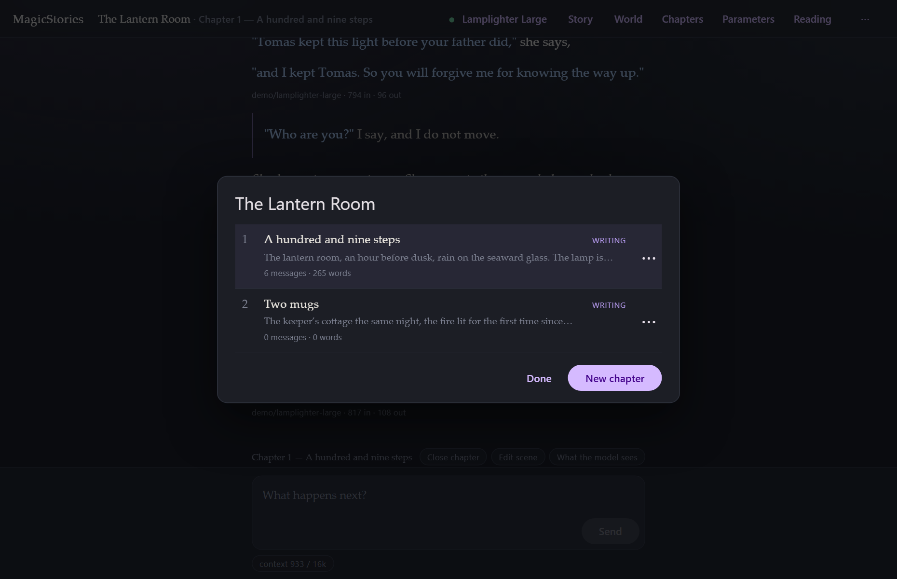

# Chapters

[← Documentation](README.md) · Previous: [Reading and writing](reading-and-writing.md) · Next: [Story and world](story-and-world.md)

---

Chapters are the reason this app exists. Everything else follows from them.

## The problem chapters solve

A long story run as one conversation gets expensive and then gets stupid. Either you keep sending
the whole thing — paying more per reply every day, until you hit the context limit — or something
quietly starts dropping the oldest messages, and the model forgets a promise made in the first
hour.

A book does not have this problem, because a book is written in chapters and each chapter carries
forward only what mattered.

So: **only the chapter you are writing is ever sent to the model.** Everything before it reaches
the model through *the story so far* — one readable page of summary that the model itself
rewrites, each time you close a chapter. A story on chapter forty costs the same per reply as one
on chapter one.

## A chapter is three things

The scene it opens on, the conversation, and the summary it closes with. All three live in one
file, `data/chapters/<id>.json`.

## The scene

**A chapter cannot be written into until its scene is written.** It is the only thing the app
insists on, and any non-empty text passes.

It is deliberately one plain-text field rather than a set of boxes for time, place and mood. A
scene heading in a playscript is free text; the model reads prose perfectly well; and any schema
imposed here would be a schema somebody has to fight. Write two words or two paragraphs.

The scene is sent **verbatim**, and it sits last in the system prompt, closest to the
conversation — it is the immediate setting, so it should be the freshest thing the model read.

It is fixed once written but never locked. **Edit scene** in the chapter toolbar (or **⋯ → Edit
this scene**) is always available, and because the prompt is rebuilt from data every time, an edit
takes effect on the very next reply without touching a word of what has already been written.

The **chapter title** is optional. Left blank, the chapter goes by the scene's first line.

## Closing a chapter

When a chapter has done what it came to do, press **Close chapter** in the toolbar under the
story.

The model is handed the story so far *as it stands*, plus this chapter's scene and everything
written in it, and asked for **the whole summary back** with this chapter folded in — not an
addition to it. That is the important part: the story so far stays one readable page however long
the story runs, instead of growing a paragraph per chapter until it is the problem it was meant to
solve.

What comes back is yours before it lands:

- **Edit it** in the box. It is just text.
- **Write it again** if you did not like it.
- **What was asked for** opens the instruction that produced it, and lets you replace it for this
  story (the same switch as **World → How a chapter is folded in**).
- **Cancel** leaves the chapter open and changes nothing.

**Close the chapter** does three things: marks the chapter closed, replaces the story so far with
the new summary, and opens the next chapter's scene sheet — pre-filled with the scene just closed,
because the next chapter is usually the same place a moment later.

Nothing is thrown away. The closed chapter keeps every message and its own copy of the summary it
produced.

## New chapter

**⋯ → New chapter** is the same act from the other end. If the chapter you are in has anything
written in it, starting the next one closes it first, so a story always carries forward as summary
rather than as transcript. A chapter with nothing in it, or one already closed, just opens the
scene sheet.

## The chapters list

**Chapters** in the top bar lists them all: number, title, the first line of the scene, and how
much is in it. **writing** or **closed** on the right.

From here you can open any chapter to read it, continue a closed one (which flips it back to
*writing* and reopens the composer), edit its scene, retitle it, or delete it.

**Chapter numbers are permanent.** They only ever go up. Delete chapter 2 and chapter 3 is still
chapter 3 — because when you say "chapter 3" you mean a particular piece of text, not the third
item in a list.

## Reading a closed chapter

Open it from the list and it is there, complete, read-only. The composer is replaced by
*Chapter 2 is closed — continue it*, which is one click away if you change your mind.
