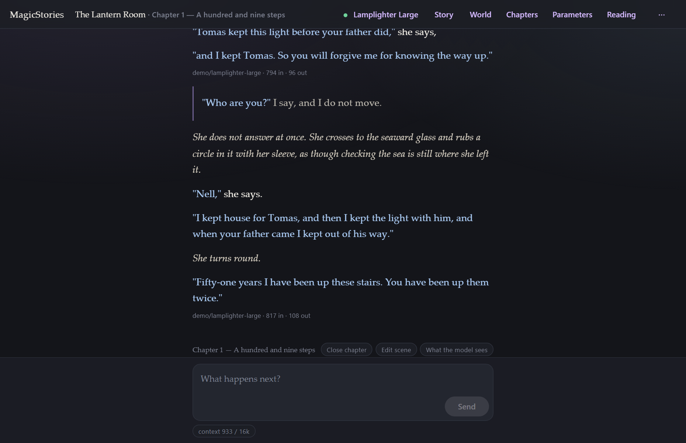

# Getting started

[← Documentation](README.md) · Next: [Reading and writing](reading-and-writing.md)

---

## What you need

- **Node.js** 20.19+, 22.12+ or 24+.
- **An OpenAI-compatible endpoint.** [NanoGPT](https://nano-gpt.com) is offered out of the box —
  it answers browser requests directly, so there is nothing to proxy. Anything else that answers
  `GET /models` and `POST /chat/completions` works too, including a local Ollama, LM Studio,
  llama.cpp or vLLM server.
- **A browser.** Any current one.

You do not need an account with anyone, and you do not need to build anything to try it.

## Running it

```bash
npm install
npm start
```

`npm start` runs both halves of the app: the persistence server on
<http://localhost:4177>, and the dev server on <http://localhost:4200> which proxies `/api` to it.
Open **4200**.

> Everything comes from the public npm registry. (`npm run aws-login` in `package.json` is the
> author's own CodeArtifact proxy — if `npm install` ever answers `E401`, that is what refreshes
> the token. It is not needed to install from npmjs.)

If you would rather have a copy that runs on its own — no repo, no `npm install`, one
double-click — build the zip instead. See [Running it anywhere](running-anywhere.md).

## The first run, in three questions

A fresh install asks you three things, in this order, and then gets out of the way. It never asks
again.

### 1. Where to send the story


This is the one screen the app opens on, because nothing else means anything until it knows where
to send the story. It will not take Escape for an answer, and **Done** stays dark until there is
an endpoint and a model. (There is a **Not now** if you want to look around first; the composer
will simply stay shut and tell you why.)

Pick **NanoGPT** and paste your key, or pick **Custom** and type any URL. Then **Fetch models**,
choose one, and — worth doing once — press **Test**, which makes one real round trip and tells you
whether the whole path works.


More on all of this in [Models and parameters](models-and-parameters.md).

### 2. Who tells the story, and who you play


- **Narrator** — one voice tells the whole story. You say what you do; it writes what happens.
- **Role-play** — the model plays the other characters and answers in their own words. You add
  the cast in **Story** afterwards.

**Who you play** is your persona: a name and a couple of lines. Both are optional, both are
editable later in **Story**, and both are sent with every request — which is why they are asked
for now rather than discovered later. See [Story and world](story-and-world.md).

### 3. The opening scene


This is the one compulsory step in the app. A chapter cannot be written into until its scene is
written, and any non-empty text will do.

Write it the way a scene opens in a playscript: where we are, when, who is on stage, and what is
happening as the lights come up. It is plain text — no fields, no schema, nothing parsed out of
it — and it reaches the model exactly as you typed it.

The **chapter title** underneath is optional. Left blank, the chapter is known by the scene's
first line.

Press **Open the chapter** and the composer appears.

## Writing the first line

Type what you do and press **Enter**. The answer streams in as it is written.



Some things worth knowing straight away:

| Key | Does |
|---|---|
| **Enter** | send |
| **Shift+Enter** | new line |
| **Ctrl/Cmd+Enter** | regenerate the last answer |
| **Ctrl/Cmd+K** | open Connection |
| **Escape** | close a modal — everything in it is already saved |

- **Stop** appears while an answer is streaming, and keeps whatever arrived before you pressed it.
- **context 805 / 16k** under the composer is what the next request will cost. Click it to see the
  whole prompt.
- Nothing has a Save button. Everything is written to disk as you type.

## Where to next

- Carry on writing, and when the chapter feels finished, read **[Chapters](chapters.md)** — the
  "close chapter" step is what makes long stories work here.
- Give the story a world: **[Story and world](story-and-world.md)**.
- Curious what is actually being sent? **[The prompt](the-prompt.md)**.
