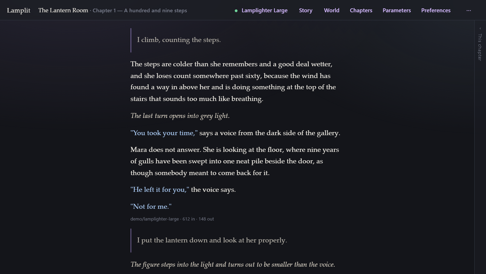
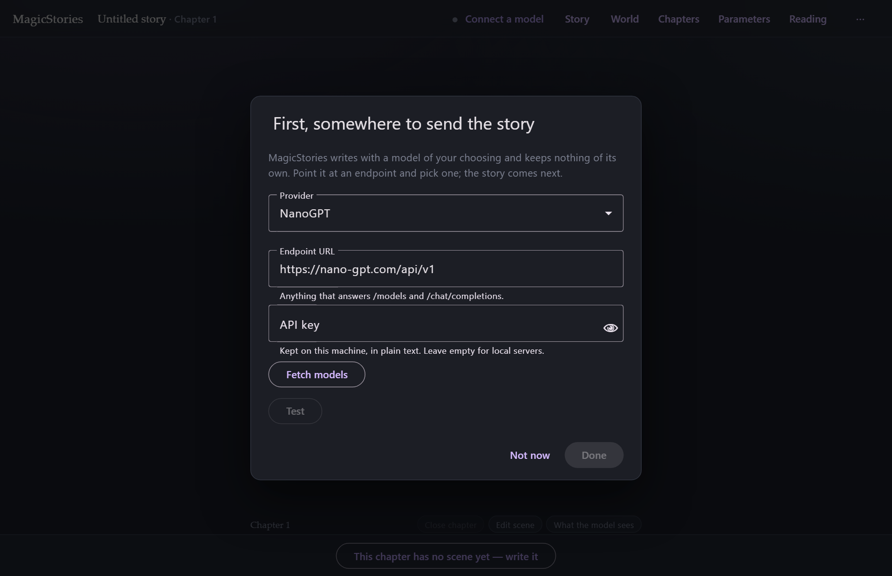
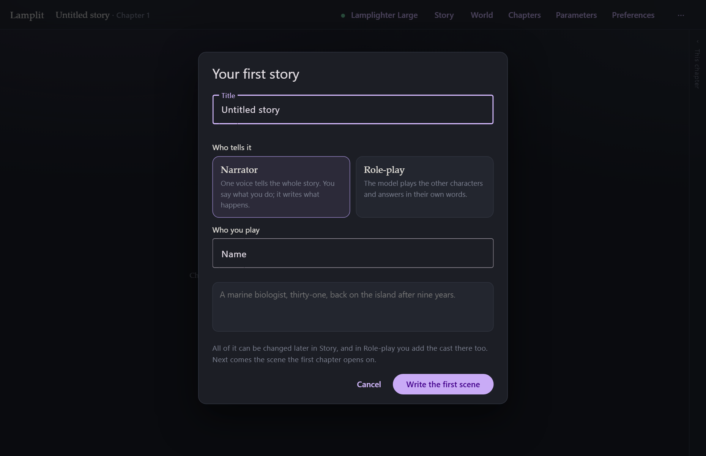
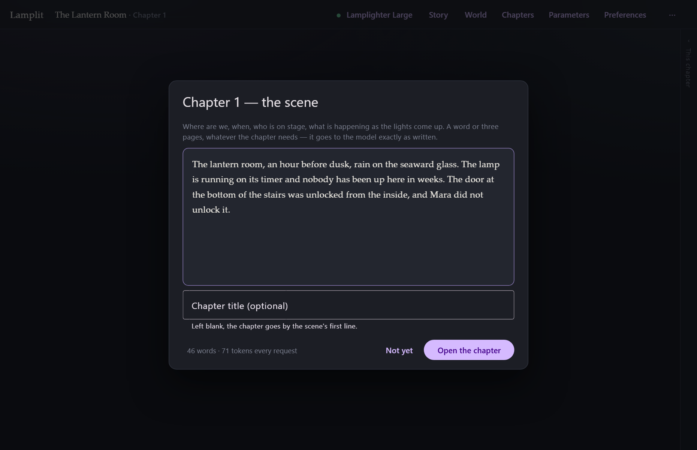

<!--
  The landing page. Written for someone who has never heard of a model endpoint,
  and kept to about five hundred words: everything mechanical is one click away,
  in the guide.

  This is the one file in docs/ that is never read on GitHub, which is why it is
  the one file with front matter and the one file written as HTML. `layout:
  landing` is docs/_layouts/landing.html — the app's own palette, the app's own
  reading serif, and no minima furniture. Everything else in docs/ is a guide
  page and keeps minima exactly as it is.

  Note on links: jekyll-relative-links rewrites `[x](y.md)` for us, but it does
  not touch href attributes in raw HTML — so links below point at .html
  directly.
-->

<header>
  

    <!-- The book from the favicon (Lucide's book-open-text, ISC — see NOTICE),
         at the weight it is drawn at 32px, so the tab and the page agree. -->
    <svg viewBox="0 0 24 24" width="24" height="24" fill="none" stroke="currentColor"
         stroke-width="2.2" stroke-linecap="round" stroke-linejoin="round" aria-hidden="true">
      <path d="M12 5v16" />
      <path d="M16 13h2" /><path d="M16 9h2" />
      <path d="M6 9h2" /><path d="M6 13h2" />
      <path d="M20.001 19A2 2 0 0 0 22 17V5a2 2 0 0 0-1.999-2L16 3.002A5 5 0 0 0 12 5a5 5 0 0 0-4-2H4a2 2 0 0 0-2 2v12a2 2 0 0 0 2 2h4.001a5 5 0 0 1 3.999 2 5 5 0 0 1 4-2z" />
    </svg>
    <b>Lamplit</b>
  

  <h1>Like reading in bed with the lamp on. Except the book writes back.</h1>

  

    Lamplit is a free, open-source writing app for long stories told a chapter at a time, with a
    language model of your choosing writing beside you. It runs on your own machine, and your
    stories are files.
  

  

    <a class="li-cta" id="li-cta" href="#download">Download Lamplit</a>
    <a class="li-elsewhere" id="li-elsewhere" href="#download" hidden>Other ways to get it</a>
  

  
Free and open source. No account, no subscription, nothing to pay us.

  

    
  

</header>

<ul class="li-reasons">
  <li><b>Free, and yours.</b> Open source, your stories are files on your own disk, no account, and nothing of ours in between.</li>
  <li><b>Any model.</b> Bring a key from whoever you like, or run one on your own computer, and pay only them.</li>
  <li><b>Chapters, and a world that remembers.</b> A long story stays coherent, and stays affordable.</li>
</ul>

## The first run, in three questions

It asks three things, and then gets out of the way.

<ul class="li-steps">
  <li>
    <h3>1. Where to send the story</h3>
    
    
Pick a provider, paste its key, choose a model, and press <b>Test</b> to be sure.

  </li>
  <li>
    <h3>2. Who tells the story</h3>
    
    
One narrator’s voice, or a cast with words of their own.

  </li>
  <li>
    <h3>3. The opening scene</h3>
    
    
Where we are, when, and what is happening as the lights come up. Then you write.

  </li>
</ul>

<h2 id="download">Download</h2>

<ul class="li-downloads">
  <li id="li-windows">
    <h3>Windows</h3>
    
For this computer

    

      Nobody paid for a signing certificate, so Windows says it <b>protected your PC</b>:
      <b>More info</b>, then <b>Run anyway</b>. There is a
      <a href="https://github.com/lamplit-app/lamplit/releases/latest/download/Lamplit-portable.exe">portable build</a>
      too, which installs nothing.
    

    <a class="li-get" href="https://github.com/lamplit-app/lamplit/releases/latest/download/Lamplit-Setup.exe">Download the installer</a>
  </li>
  <li id="li-linux">
    <h3>Linux</h3>
    
For this computer

    

      An AppImage installs nothing: allow it to run — <b>Properties → Permissions</b> — and open
      it. Or the
      <a href="https://github.com/lamplit-app/lamplit/releases/latest/download/Lamplit.deb">.deb package</a>,
      for Debian, Ubuntu and their relatives.
    

    <a class="li-get" href="https://github.com/lamplit-app/lamplit/releases/latest/download/Lamplit.AppImage">Download the AppImage</a>
  </li>
  <li class="li-off" id="li-macos">
    <h3>macOS</h3>
    
For this computer

    

      A build that opens without a fight needs Apple’s developer licence, which this project does
      not hold. Lamplit still runs on a Mac, as
      <a href="running-anywhere.html">a zip you start by double-clicking</a>.
      <a href="https://github.com/lamplit-app/lamplit/issues">Contributing the builds</a>
      would be very welcome.
    

    No installer
  </li>
</ul>

<!-- #39's licence card — "What you are getting, and what you take on" — goes
     here, between the slots and the note, as a 
. -->

Each download is about 110 MB, nearly all of it the browser engine the window is made of.
<a href="desktop.html">The desktop app</a> says where your stories are kept.

Other ways to run it: <a href="running-anywhere.html">the zip</a>, one megabyte, for a Mac or any
machine that already has Node.js.

## Where do I get a key?

An **aggregator** is the easiest start — one key, most models that exist:
[OpenRouter](https://openrouter.ai/keys), [NanoGPT](https://nano-gpt.com/api), or
[Pollinations](https://auth.pollinations.ai), which has a free tier that works with no key at all.

Or go straight to the people who made the model: [OpenAI](https://platform.openai.com/api-keys),
[Anthropic](https://console.anthropic.com/settings/keys),
[Google](https://aistudio.google.com/apikey), and a dozen more in the app's own list.

Or pay nobody at all, and run the model on your own computer with
[Ollama](https://ollama.com) or [LM Studio](https://lmstudio.ai).
[Models and parameters](models-and-parameters.md) has the rest.

## Where it comes from

Lamplit began as a replacement for SillyTavern, for someone who wanted its freedom — any model,
your own key, your own machine — without its dashboard. If you have used SillyTavern, or paid for
NovelAI, Sudowrite or Novelcrafter, this is the same idea pointed at long-form stories: text only,
nothing hidden, and nothing to pay but what your provider charges.

<a href="README.html">The guide</a> covers the whole app: chapters, the world your story
remembers, what is sent to the model, and where your files are. What changed in each version is on
the <a href="releases.html">release notes</a>. The source, and where to
<a href="https://github.com/lamplit-app/lamplit/issues">report anything wrong</a>, is on
<a href="https://github.com/lamplit-app/lamplit">GitHub</a>.

This site sets no cookies and loads nothing from anyone else.

