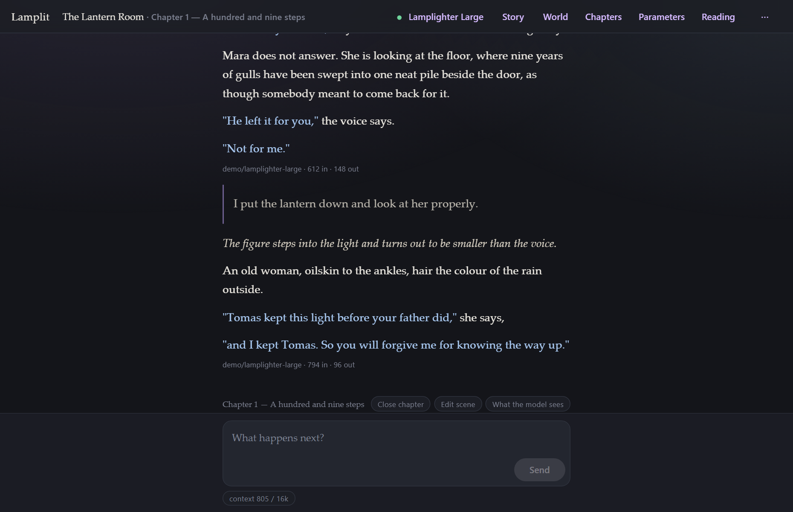

<!--
  The landing page. Written for someone who has never heard of a model endpoint.

  Note on links: jekyll-relative-links rewrites `[x](y.md)` for us, but it does
  not touch href attributes in raw HTML — so links inside the blocks below point
  at .html directly. This page only ever exists as the website; every other page
  in docs/ is read on GitHub too, and keeps its .md links.
-->

# Write a story with a machine that can write

Lamplit is a writing app for stories told a chapter at a time, with a language model of your
choosing doing the writing beside you. It runs <b>on your own machine</b>. Your stories are files
you can read, copy and back up. Your key goes to your provider and nowhere else — there is no
account, no server of ours, and nothing to sign up for.

It is <b>not</b> a chatbot in a costume, and not somewhere your writing is kept for you. No
images, no marketplace, no feed. Somewhere to write a long story, and keep it.

## Download it

<ul class="ms-downloads">
  <li>
    <h3>Windows</h3>
    <a class="ms-get" href="https://github.com/GaetanGiraud/lamplit/releases/latest/download/Lamplit-Setup.exe">Download the installer</a>
    

      The first time you run it, Windows says <b>“Windows protected your PC”</b>. That warning is
      about who paid for a signing certificate, not about what is in the file. Click
      <b>More info</b>, then <b>Run anyway</b>.
    

    

      Or the <a href="https://github.com/GaetanGiraud/lamplit/releases/latest/download/Lamplit-portable.exe">portable version</a>,
      which installs nothing and keeps your stories beside it — a USB stick can carry both.
    

  </li>
  <li>
    <h3>Linux</h3>
    <a class="ms-get" href="https://github.com/GaetanGiraud/lamplit/releases/latest/download/Lamplit.AppImage">Download the AppImage</a>
    

      An AppImage installs nothing. Once it has downloaded, make it runnable —
      <b>Properties → Permissions → Allow executing</b>, or
      <code>chmod +x Lamplit.AppImage</code> — and open it like anything else.
    

    

      Or the <a href="https://github.com/GaetanGiraud/lamplit/releases/latest/download/Lamplit.deb">.deb package</a>,
      for Debian, Ubuntu and their relatives.
    

  </li>
  <li class="ms-off">
    <h3>macOS</h3>
    Not available
    

      A macOS build that opens without a fight needs Apple’s developer licence, which this project
      does not hold. Rather than hand you something your Mac refuses to open, there is nothing here.
    

    

      <b>If you have that licence and would like to contribute the builds,</b>
      <a href="https://github.com/GaetanGiraud/lamplit/issues">open an issue</a> — that is the
      one way to reach this project, and it would be very welcome.
    

    

      Meanwhile Lamplit runs on a Mac
      <a href="https://github.com/GaetanGiraud/lamplit#quick-start">from the source</a>, or as
      <a href="running-anywhere.html">the zip</a> if you already have Node.js.
    

  </li>
</ul>

Each download is about 110 MB, nearly all of it the browser engine the window is made of.
<a href="desktop.html">The desktop app</a> says where your stories are kept, how to move them, and
why uninstalling leaves them alone.

## The first run, in three questions

It asks three things, and then gets out of the way. It never asks again.

<ul class="ms-steps">
  <li>
    <h3>1. Where to send the story</h3>
    
    

      Pick a provider, paste the key it gave you, choose a model. <b>Test</b> makes one real
      request, so you find out the whole path works before you start writing rather than
      mid-sentence.
    

  </li>
  <li>
    <h3>2. Who tells the story</h3>
    
    

      <b>Narrator</b> tells the whole story in one voice. <b>Role-play</b> gives the other
      characters their own words. Then a line or two about who you play.
    

  </li>
  <li>
    <h3>3. The opening scene</h3>
    
    

      Where we are, when, who is on stage, and what is happening as the lights come up. Plain
      text, nothing parsed out of it. Then you write.
    

  </li>
</ul>

## Where do I get a key?

Lamplit sells nothing and takes no cut. You bring a key from whoever you want to write with,
and the app talks to them straight from your machine.

If you have never done this before, an **aggregator** is the easiest start: one key, and every
model behind it.

| | |
|---|---|
| [OpenRouter](https://openrouter.ai/keys) | One key, most models that exist, pay as you go |
| [NanoGPT](https://nano-gpt.com/api) | The same idea, a large list, no subscription |
| [Pollinations](https://auth.pollinations.ai) | Has a free tier that works with no key at all |

Or go straight to the people who made the model — [OpenAI](https://platform.openai.com/api-keys)
for GPT, [Anthropic](https://console.anthropic.com/settings/keys) for Claude,
[Google](https://aistudio.google.com/apikey) for Gemini, and a dozen more in the app's own list.

Or pay nobody at all, and run the model on your own computer with
[Ollama](https://ollama.com) or [LM Studio](https://lmstudio.ai). Every provider the app knows,
and what each one needs, is in [Models and parameters](models-and-parameters.md).

## Then read the guide

**[The guide](README.md)** covers the whole app: [chapters, and how a long story stays
affordable](chapters.md), [the world your story remembers](story-and-world.md), [exactly what is
sent to the model](the-prompt.md), and [where your files are](your-data.md).

---

Free and open source, MIT licensed, on
<a href="https://github.com/GaetanGiraud/lamplit">GitHub</a> — which is also where to
<a href="https://github.com/GaetanGiraud/lamplit/issues">report anything wrong</a>. To run it
from the source, or build it yourself, start at <a href="development.html">Development</a>.

