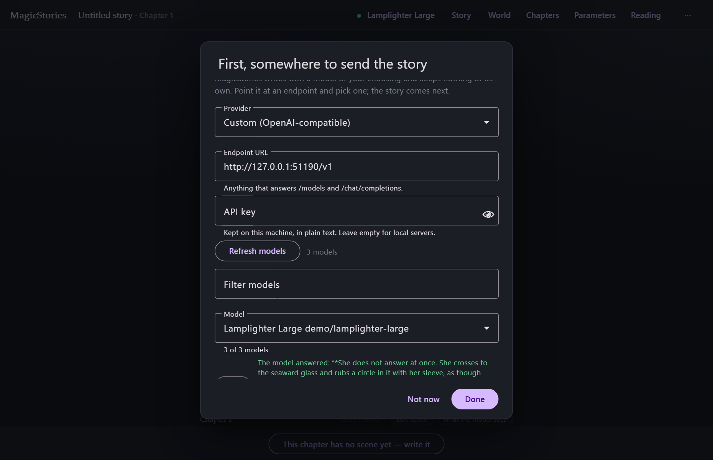
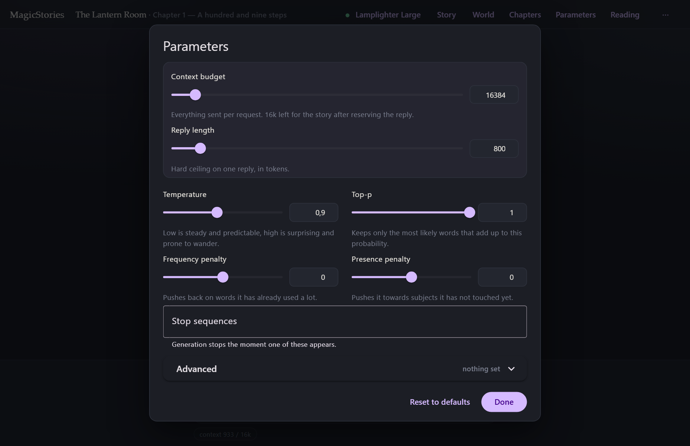

# Models and parameters

[← Documentation](README.md) · Previous: [The prompt](the-prompt.md) · Next: [Your data](your-data.md)

---

## Connecting

**Ctrl/Cmd+K**, or the model name in the top bar.

| | |
|---|---|
| **Provider** | **NanoGPT** fills the URL in for you. **Custom** lets you type any URL that answers `GET /models` and `POST /chat/completions` in OpenAI's shape. |
| **Endpoint URL** | Ends at `/v1` (or wherever your server puts those two paths). |
| **API key** | Sent as `Authorization: Bearer …`. Leave it empty for a local server that does not want one. |
| **Fetch models** | Reads the endpoint's own list. Filter it, then pick one. |
| **Test** | One real round trip. Worth doing once — it tells you whether the URL, the key and the model all work together, rather than making you find out mid-sentence. |

Every change is saved the moment you make it, so however you close this modal, it has already
been kept.

### The browser talks to the model directly

There is no proxy and no SDK. Your key goes from your browser to your provider and nowhere else —
in particular, not through the persistence server, which never sees it and has no idea a model
exists.

The one consequence is **CORS**: your endpoint has to allow browser requests. NanoGPT does.
Most local servers do, or have a flag for it. If a request fails with a network error but the URL
is right, that is almost always what happened.

### Known-good endpoints

| | URL |
|---|---|
| NanoGPT | `https://nano-gpt.com/api/v1` |
| Ollama | `http://localhost:11434/v1` |
| LM Studio | `http://localhost:1234/v1` |
| llama.cpp server | `http://localhost:8080/v1` |
| vLLM | `http://localhost:8000/v1` |

Anything else OpenAI-compatible should work; only streaming chat completions are used.

## Parameters

### The two that matter most

- **Context budget** — everything sent per request, in tokens. The prompt builder trims the
  oldest messages to fit it. See [The prompt](the-prompt.md).
- **Reply length** — a hard ceiling on one answer, in tokens. It is reserved out of the budget
  before trimming, which is why the hint under the budget says how much is left for the story.

### The usual sampling set

| | |
|---|---|
| **Temperature** | Low is steady and predictable, high is surprising and prone to wander. |
| **Top-p** | Keeps only the most likely words that add up to this probability. |
| **Frequency penalty** | Pushes back on words it has already used a lot. |
| **Presence penalty** | Pushes it towards subjects it has not touched yet. |
| **Stop sequences** | Generation stops the moment one of these appears. |

### Advanced

Behind the **Advanced** panel: `top_k`, `min_p`, `repetition_penalty`, `top_a`, `seed` and
`reasoning_effort`.

These are **only sent once you switch them on.** An endpoint that does not understand
`repetition_penalty` never sees the field, so turning one on for NanoGPT does not break the same
story pointed at something stricter later.

**Reset to defaults** puts the whole set back.

> Parameters are global, not per story — they are how *you* like models to behave, and they live
> in `settings.json` next to your connection.

## Reading the numbers

Under each answer (when **Show token counts** is on in the **Reading** menu) is the model that
wrote it and the turn's real cost as the provider reported it: `612 in · 148 out`.

The pill under the composer is the *estimate* for what you are about to send. Comparing the two
over a few turns tells you how far off the estimate is for your model, and whether your budget is
where you want it.
