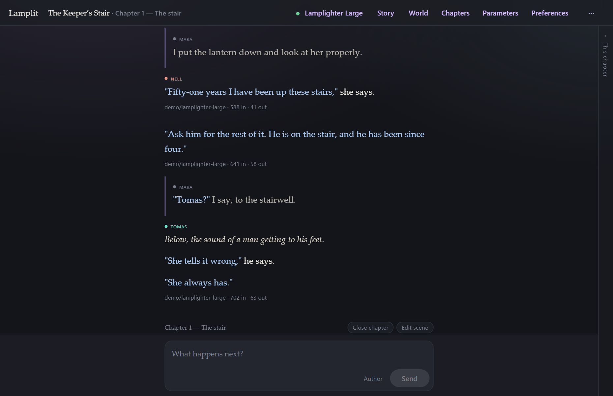
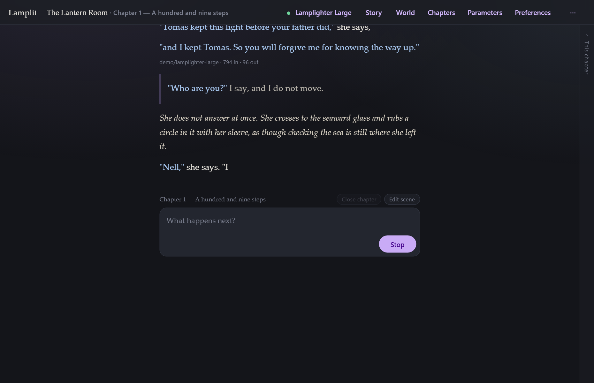
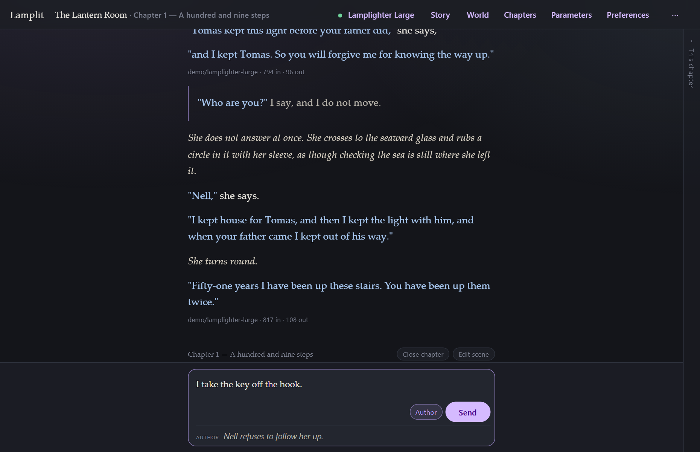
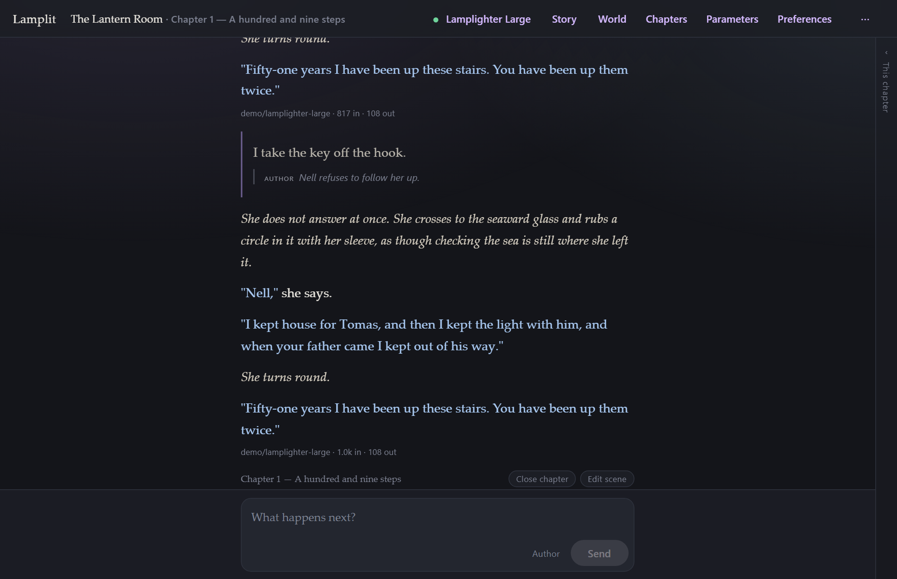
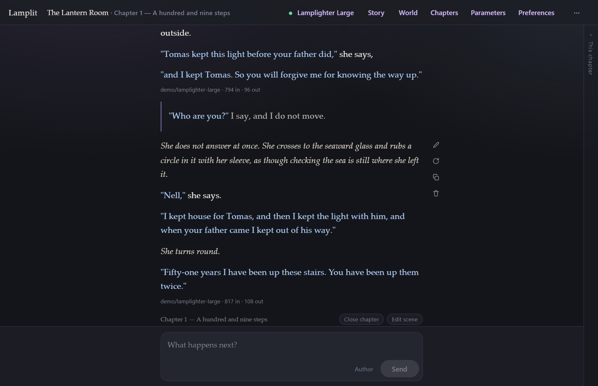
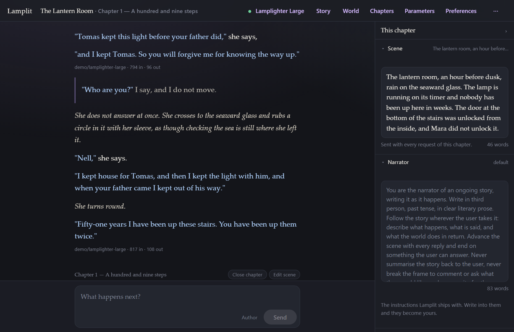
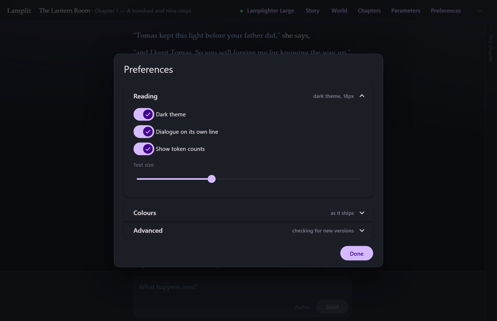
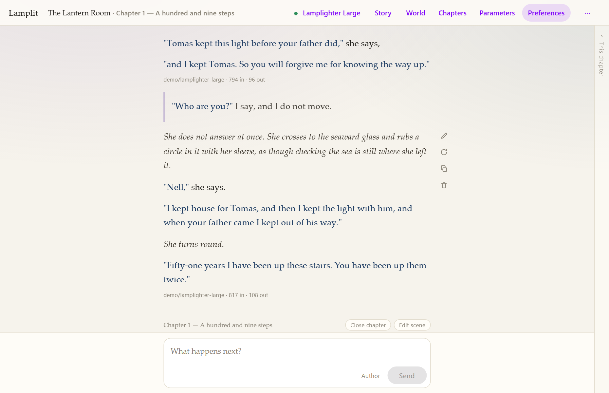
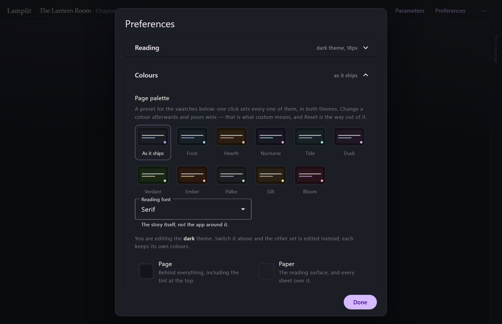
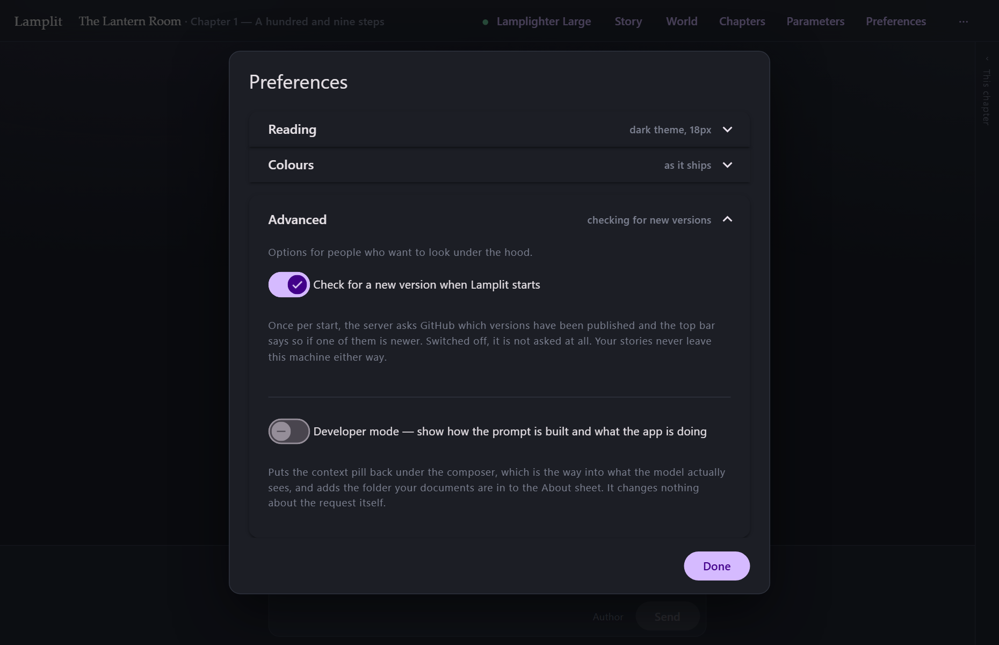

# Reading and writing

[← Documentation](README.md) · Previous: [Getting started](getting-started.md) · Next: [Chapters](chapters.md)

---

The page is the app. Everything else opens over it and gets out of the way again.

## The page

Your lines sit in a quiet block with a rule down the side. The model's answers are set as prose,
in a serif, at a measure that is comfortable to read rather than as wide as your monitor.

Three things are done to the model's text as it arrives:

- **Markdown** is rendered (and sanitised — nothing from a model can run in your browser).
- **"Quoted speech"** is set apart in its own colour, so a page of dialogue reads as dialogue.
- **`*Actions in asterisks*`** are italicised.

Under each answer, if you want it, is the model that wrote it and what the turn actually cost —
`612 in · 148 out`, taken from the provider's own usage rather than guessed.

## Who is speaking

A story with a cast, played [one character at a time](story-and-world.md), puts a small name above
each passage: the character who wrote it, in their own colour, with a dot to match. Your own lines
carry your persona's name, quietly, and a run of turns by the same speaker is named once — the
second one is the same person still talking.

That is the whole of it. No avatars, no boxes, no borders: it is set in the interface font at the
size the meta line uses, so it reads as a note above the words rather than as the first of them.

- **A narrator's story has no labels at all.** The page is the narrator's and you know it.
- **Nor does an ensemble**, where the model answers as whoever the moment calls for: no single
  character wrote the passage, and the prose carries the names as it always did.
- **A name is the one that was stored when the line was written.** Rename a character and what she
  already said stays in her old name; only what she says next is Anna. Delete her and her lines
  keep her name, in the muted colour, because the colour went with her.
- **A switch mid-chapter shows the label again**, even where the two passages are by the same
  character: something happened between them.

## The composer

The box grows as you type, up to a point, and then scrolls. It is not there at all when the
chapter cannot be written into — instead you get the reason and the button that fixes it:

> *This chapter has no scene yet — write it*
> *Chapter 2 is closed — continue it*
> *Pick a model in Connection*

| Key | Does |
|---|---|
| **Enter** | send |
| **Shift+Enter** | new line |
| **Ctrl/Cmd+Enter** | regenerate the last answer |

**Stop** replaces **Send** while an answer streams, and keeps whatever arrived before you pressed
it — a half-written passage is still a passage, and you can edit it or carry on from it.

Scroll up to read back and a small **↓** appears in the margin, in the same column as the message
actions: one click and you are at the end again. Streaming never drags you back on its own.

### Saying it as the author

Sometimes what you want to say is not your character's. *The storm arrives tonight. She should
refuse.* Written into the story it is a hint the model may or may not take; written as a
**direction** it is an instruction the model is told to follow.

Two ways to write one, and they end in the same place:

- **The Author button** beside **Send** opens a field under the box, and the cursor goes into it.
- **`[AUTHOR]` at the start of a line** takes that line and everything after it out of the prose
  and into that field as you type. The tag is removed. It is a shorthand for the button, not a
  syntax: the split happens in front of you, so what leaves the composer is always what you can
  see in it.

A message can be prose, a direction, or both — *"Mara pushes the door open."* with *"The room is
empty, and it should not be."* underneath it. Send with either half filled.

In the page it is a note under your prose — the interface font, italic, indented, labelled
**author** — and never set as story text, because it is not any. **Edit** opens both halves in
their own fields, and either one can be emptied. Closing the field with the button throws away
whatever is in it, rather than sending it quietly.

What the model is told, and where the direction sits in the request, is
[The prompt → Author](the-prompt.md). The short version: it is sent with your message, marked
`[Author: …]`, it stays in the chapter for the turns that follow, and it is left out of the
summary when the chapter closes. It shaped the story; it is not in it.

### When a chapter outgrows the budget

If the chapter has grown past what fits in one request, a note appears under the composer — *3
older messages left out* — so the trimming is never silent. What was dropped, and everything else
the request carries, is [What the model sees](the-prompt.md), which lives behind **Developer
mode** — see below.

## What each message can do

Hover a message, or tab into it, and four small marks appear **in the margin** beside it — out
past the edge of the text, never on top of it, so crossing the page with the pointer never takes a
word away from you.

| | |
|---|---|
| **Edit** | Change the text in place. On a user line this is how you fix a typo without re-rolling; on an answer it is how you keep a good passage with one bad sentence. |
| **Replay from here** *(your lines)* | Drop everything after this line and send it again. |
| **Regenerate** *(answers)* | Drop this answer and everything after it, and ask again. |
| **Copy** | The raw text, as written. |
| **Delete** | Just that message. |

Hovering each one says which it is. On a **narrow window or a touch screen** there is no margin to
write in and no pointer to hover with, so the same actions sit behind a single **⋯** under the
message, on the line that already carries the model and the token count.

None of these are special paths. Because the prompt is rebuilt from the documents on every
request, an edit or a regenerate goes down exactly the same road as a fresh send — there is no
conversation state to get out of step. See [The prompt](the-prompt.md).

If a request fails, the answer is replaced by the provider's own words and two buttons,
**Try again** and **Dismiss**. A rejected key reads as a rejected key.

## The chapter panel

The four things that shape the chapter being written — the **scene**, the **narrator's
instructions**, your **persona** and the **cast** — used to be behind modals that covered the page.
They are down the right-hand side now, beside the words rather than on top of them.

It is a thin edge until you want it. Click the edge, or press **Ctrl+.**, and it slides open;
either one shuts it again, and it opens the way you left it next time. Each section folds away on
its own, and those stay folded too.

- **Scene** — the chapter's own scene, edited where it is. The mark appears once the text differs
  from what is stored, and leaving the field saves it; there is no Save button to hunt for. A
  closed chapter shows its scene and will not take a change to it.
- **Narrator** *(narrator mode)* — the instructions the model is given. The default sits in the box
  greyed out; write into it and it becomes yours, with **Back to the default** to hand it back.
  Your own text is kept either way, so switching between them loses nothing.
- **Persona** — a name and a few lines. It belongs to the story rather than the chapter, and it is
  sent with every request in both modes.
- **Cast** *(role-play mode)* — one row per character: their colour, their name and the first line
  of their description. The dot opens the palette of ten. The switch on a row takes them in and out
  of the scene; when the story is cast
  [one character at a time](story-and-world.md), clicking a row hands the model that character
  from there on, and the row being played is marked. The pencil at the end opens them in the
  **Story** sheet, because a character is a name and a paragraph and that is more than a row can
  hold.

Nothing about the app is in here — no connection, no sampling parameters, no reading settings.
Those are not chapter fields, and they stay behind their own sheets.

**On a wide window** the panel takes its width out of the page: the reading column narrows and
every word of it stays visible. **On a narrow one** there is nothing left to give, so it comes over
the page instead, with **Escape** or a click on the page behind it to send it away. The composer is
usable either way — the panel never takes the box you are writing in.

## Preferences

**Preferences** in the top bar holds everything that changes how the story looks to you and
nothing about what is sent. It opens on **Reading**, with **Colours** and **Advanced** folded
away underneath.

### Reading

- **Dark theme** — on by default.
- **Dialogue on its own line** — breaks each quoted line onto its own paragraph. This only has
  visible work to do when a model runs narration and dialogue together in one block; models that
  already break their own lines look the same either way.
- **Show token counts** — the line under each answer.
- **Text size** — 14 to 26 pixels.

> These are reading preferences and live in `settings.json`, not in the story. The *prompt*
> instructions that ask the model to put dialogue on its own line, or to answer at a particular
> length, live in **Story → Style** — see [Story and world](story-and-world.md).

### Colours

Every colour the two themes differ on is here, one swatch each, and changing one redraws the page
as you drag. Nothing has been added to the palette that was not already in it: **Page**, **Paper**,
**Raised paper**, **Rules**, **Text**, **Your own lines**, **Action**, **Muted text**, **Accent**,
**Dialogue** and **Errors** are the names the stylesheet itself uses, and each says what moves
when it moves.

- **Each theme keeps its own set.** Editing while the dark theme is on edits the dark colours;
  switch to light in **Reading** and you are editing the light ones. Neither touches the other.
- **Reading font** — the serif it ships with, a sans-serif, or a monospace, all from fonts your
  computer already has. It sets the story itself; the app around it stays as it is.
- **Reset the … colours** puts one theme back to exactly what Lamplit ships, and asks first. It
  clears only what you changed, so a colour you never touched cannot drift.
- **A contrast warning**, not a block. If your text and your paper fall below the 4.5:1 that WCAG
  AA asks of body text, it says so and lets you carry on.

Only what you changed is written down, so a colour a later version of Lamplit improves still
reaches you unless you had overridden that exact one.

At the foot of the section is **the cast of the open story**, one colour input each. Every
character already has a colour from a palette of ten — see
[Story and world](story-and-world.md) — and this is the way out of the ten: a colour of your own,
used in both themes, with **Back to the palette** to give it back. It belongs to the story rather
than to the app, so it travels with a duplicate and goes with a deletion.

### Advanced

Options for people who want to look under the hood. There are two.

**Check for a new version when Lamplit starts** — on by default. Once per start, the server asks
GitHub which versions have been published, and the top bar says so when one of them is newer.
Switched off, it is not asked at all. See [Upgrading](upgrading.md) for what the request carries
and what the pill leads to.

**Developer mode** puts back the parts of the app that are about the app rather than about the
story, and it is off on a fresh install:

- The **context pill** under the composer — `context 805 / 16k`, a live count of what the next
  request will carry against your budget, updating as you type. Clicking it is the way into
  [What the model sees](the-prompt.md).
- The folder your documents are in, under the version in **⋯ → About Lamplit**.

It changes nothing about the request. A story written with it on and a story written with it off
send exactly the same thing; the difference is only whether you can watch.

## Getting around

The top bar always says which story and which chapter you are in, and which model is answering.
Click the story name for the story menu — switch, rename, duplicate, delete, or start a new one.
The **⋯** menu holds **New chapter**, **Edit this scene**, **Clear this chapter**, and
**About Lamplit** — which says exactly which build you are running, the line to quote in a bug
report. See [Upgrading](upgrading.md).

Everything is saved as you write it. There is no Save button anywhere in the app, and Escape out
of any modal keeps what you typed in it.
