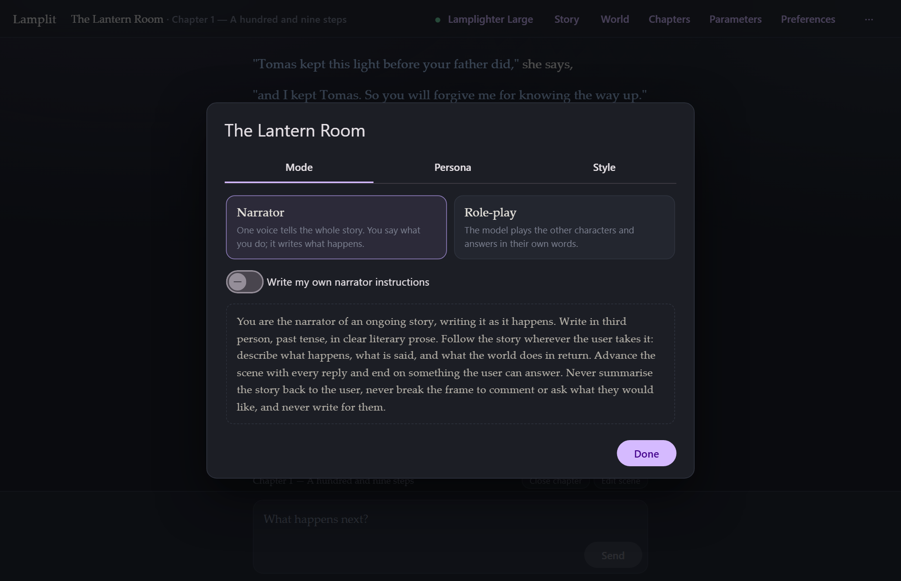
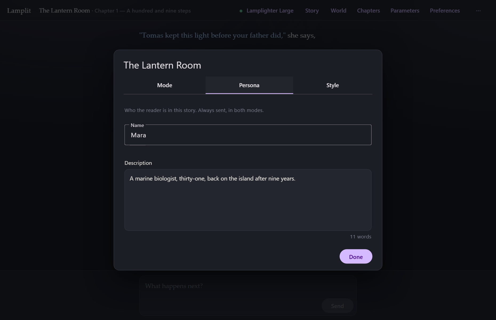
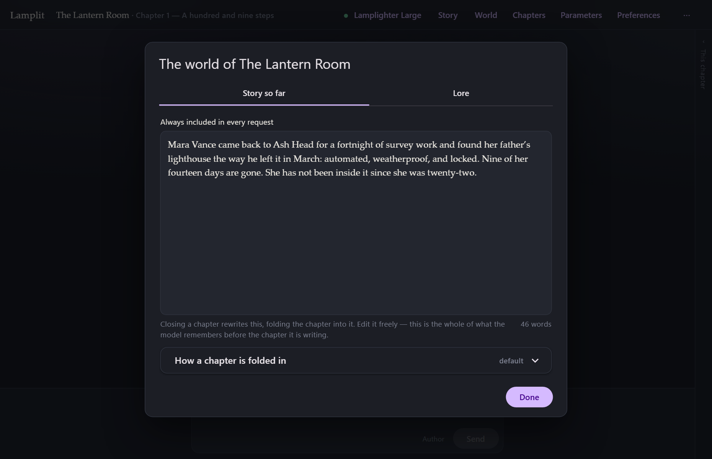
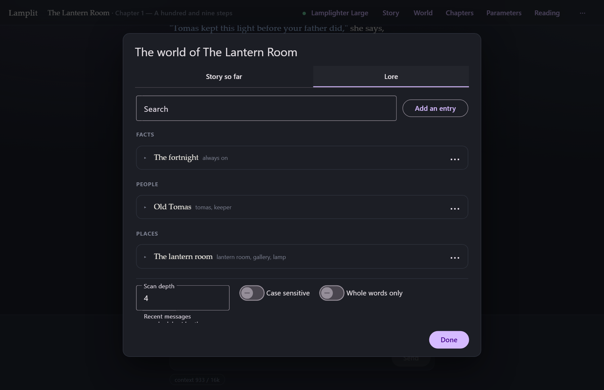
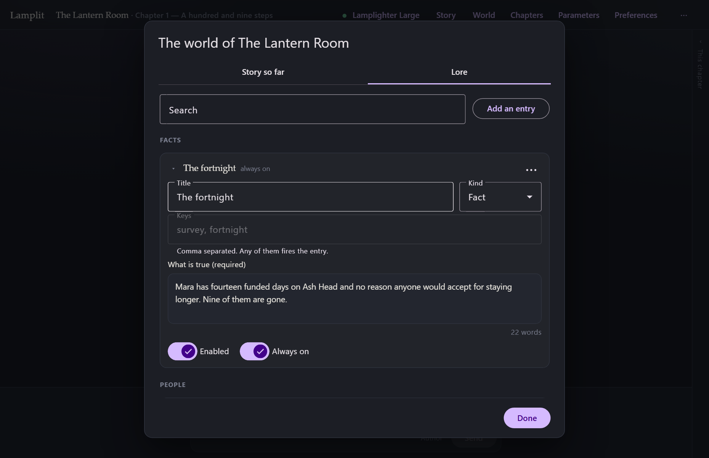

# Story and world

[← Documentation](README.md) · Previous: [Chapters](chapters.md) · Next: [The prompt](the-prompt.md)

---

A **story** is one self-contained document: who tells it, who you play, how it should read, and
everything that is true in its world. Its chapters are separate documents; the story is the thing
they all share.

Two modals hold all of it: **Story** and **World**. The scene, the narrator, the persona
and the cast are also in the [chapter panel](reading-and-writing.md), beside the page, for
the edits you want to make without leaving the story.

## Story → Mode

### Narrator

One voice tells the whole story. You say what you do; it writes what happens, what is said, and
what the world does in return. The default instruction asks for third person, past tense, clear
literary prose, and for it to end on something you can answer — and never to write for you.

**Write my own** replaces that instruction entirely, for this story. The default is shown so you
can see what you are replacing.

### Role-play

The model plays the other characters and answers in their own words. Add them here — a name and a
description each — and switch any of them off without deleting them, either here or on the row in
the [chapter panel](reading-and-writing.md).

**Each one gets a colour** from a palette of ten, the moment it is added. Nobody is asked: the
first ten characters in a story are all different, and an eleventh shares with the first. The dot
beside a name opens the palette, and one more click changes it.

There is no colour picker there on purpose. Every one of the ten clears WCAG AA against both
papers and was chosen to stay as far as it can from the other nine once a common colour-vision
deficiency has flattened them — a free colour promises none of that. If you want one anyway,
**Preferences → Colours** lists the cast with a colour input each; that colour is used in both
themes, and **Back to the palette** undoes it.

A story written before any of this opens coloured, worked out from each character's place in the
cast, so it opens the same way every time.

There are two ways to cast it, and the choice sits under the mode.

**Ensemble** is the default and what the app has always done. The model plays every character in
the scene and answers as whoever the moment calls for. The prompt becomes *"You are playing X and
Y"* followed by each description. Pick it for a room: a scene where several people talk to each
other as much as to you, and you would rather the model decide who speaks than tell it.

**One at a time** gives the model a single character to be. The rest are named as present — it may
describe what they do, as your character sees it — but it never speaks for them. Pick it for a
conversation: one person across a table, whose voice you want to stay put. The prompt becomes
*"You are playing X, and nobody else"*, and the rule about never writing for your persona extends
to everybody else on stage.

**Switching** is in the chapter panel's **Cast** section: click a row and the model plays that
character from there on. The row that is being played is marked, and the little switch on each row
takes a character in and out of the scene.

The model is told when any of that changes, at the point in the chapter where it changed:

> *From here you play Tomas. Nell is no longer the character you play; everything above in Nell's
> voice was Nell, not you.*
>
> *Isa has left the scene.* / *Isa joins the scene.*

Nothing already written is rewritten — the model is told what it was, and the chapter reads exactly
as it did. The notes are in [What the model sees](the-prompt.md) under **This chapter**, and each
answer remembers who wrote it: closing the chapter summarises it with the right names attached, and
the page says [who is speaking](reading-and-writing.md) above each passage.

## Story → Persona

Who *you* are in this story: a name and a few lines. It is sent with every single request, in
both modes, because it is the one thing the model cannot infer from the text.

Both fields are optional. Both are worth filling in.

## Story → Style

Two settings, and both of them become a sentence in the style rules the model is sent:

- **Ask for each spoken line on its own paragraph.**
- **Reply length** — short, medium or long.

> This is the half of "style" that is a *request to the model*. The half that is about how the
> text is drawn on your screen — text size, theme, whether quoted lines are visually broken out —
> lives in **Preferences → Reading** and changes nothing about the prompt. See
> [Reading and writing](reading-and-writing.md).

## World → Story so far

One page of prose that is **always sent**, no conditions. It is the memory of everything before
the current chapter.

You can write it yourself — it is just a text box — but mostly you will not have to: **close
chapter** rewrites it for you, folding the chapter just finished into it. See
[Chapters](chapters.md).

**How a chapter is folded in** is the instruction that does that rewriting, and this is where you
replace it for this story if the default is not to your taste. **Folded in so far** underneath
lists which chapters have been folded in.

## World → Lore

Lore is everything that is true in the world but only worth sending *when the story is about it*.
People, places, facts. Entries collapse to a single line — title, keys, state — so a world can
hold dozens and still be read at a glance, grouped by kind.

Open one to edit it:

| Field | |
|---|---|
| **Title** | What you call it. Also the label in the collapsed list. |
| **Kind** | Fact, person, place or other. Only groups the list. |
| **Keys** | Comma separated. Any one of them fires the entry. |
| **What is true** | The sentence the model actually receives. Required — an entry without it is flagged rather than quietly skipped, because an entry *is* the sentence it contributes. |
| **Enabled** | Off means it never fires. Useful for something not true *yet*. |
| **Always on** | Skip the keyword scan; send it every time. |

### How the scan works

Before each request the app searches a window of text for every enabled entry's keys. The window
is:

- the chapter's **scene**,
- what you have **just typed**,
- and the last **N messages** of the chapter.

N is **Scan depth** at the bottom of the tab (4 by default). Matching is case-insensitive
substring by default; **Case sensitive** and **Whole words only** are there if a short key is
firing on the wrong thing.

Entries that fire are sent as a "What is true in this world" block. Entries that do not fire cost
nothing. You can always check which fired, and on which key, in
[What the model sees](the-prompt.md).

## Several stories

The story name in the top bar opens the story menu: switch between them, **Rename**,
**Duplicate**, **Delete**, or **New story…**.

Each story is self-contained — persona, cast, world and all — so **Duplicate** is how you reuse a
setup for a new run without a shared library to maintain. Deleting a story deletes its chapters
with it, and asks first.
