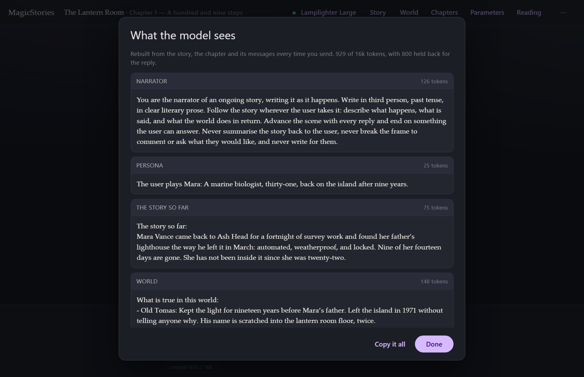

# The prompt

[← Documentation](README.md) · Previous: [Story and world](story-and-world.md) · Next: [Models and parameters](models-and-parameters.md)

---

**Every request is rebuilt from scratch, from your documents, every single time.**

Nothing is remembered between requests. There is no accumulated conversation object, no hidden
history, no state that drifted three hours ago. If you edit a scene, change your persona or switch
a lore entry off, the very next reply is built from the new version — without touching a word of
what has already been written.

That one rule is why edit, regenerate and replay-from-here are not special cases in this app: they
all go down exactly the same road as a fresh send.

## What goes on the wire

One `system` message, then the chapter's messages, then your new line.

The system message is assembled in this order:

| # | Block | When |
|---|---|---|
| 1 | **Mode preamble** — the narrator instruction, or "You are playing X and Y" plus each character's description | always |
| 2 | **Persona** — "The user plays *name*: *description*" | when you have set one |
| 3 | **The story so far** | when it is not empty |
| 4 | **What is true in this world** — lore entries that fired | when any fired |
| 5 | **This chapter** — "Chapter *n*, *title*. The scene:" then the scene, verbatim | always |
| 6 | **Style rules** — dialogue, reply length, stay in character, never write for the persona | always |

The order is not arbitrary. The scene sits **last**, closest to the conversation, because it is
the immediate setting and should be the freshest thing the model read. The mode preamble sits
first because it is the standing instruction everything else qualifies.

Then the chapter's messages, oldest first — and **only this chapter's**. Earlier chapters reach
the model through block 3 and nowhere else. That is the whole point of
[chapters](chapters.md).

## The context budget

Before sending, the app adds up the system message, the history and a reserve for the reply, and
compares it to **Max context tokens** in [Parameters](models-and-parameters.md).

If it does not fit, the **oldest messages are dropped first** until it does. The system message is
never trimmed — the scene, the persona and the world are what keep the story coherent, so they
stay and the transcript gives way.

This is never silent. The composer says *3 older messages left out* beside the context pill when
it happens, and it is the signal that the chapter has run long enough to close.

> Token counts before sending are an **estimate** (characters ÷ 3.6). Exact counting is
> provider-specific and not worth a 400 kB dependency to be approximately as wrong. After each
> reply the app shows the provider's *real* usage under the answer, so you can calibrate the
> budget against what you are actually billed.

## Looking at it

Click the **context** pill under the composer, or **What the model sees** in the chapter toolbar.

Every block, in order, with what it costs. At the top: the total, the budget, and how much is
being held back for the reply.

For lore, it also says **which entries fired and on which key** — *fired on "keeper" in the
scene* — which is the fastest way to work out why an entry did or did not turn up.

**Copy it all** puts the whole assembled prompt on your clipboard, which is handy for pasting into
another tool to compare, or into a bug report.

If you have typed something in the composer, the preview includes it. The pill is live: it
updates as you type, so you can see a long message pushing you toward the budget before you send
it.

## The summary request

Closing a chapter uses a different prompt, built the same way: the story so far as it stands, the
chapter's scene, everything written in the chapter, and then the fold-in instruction. It asks for
the **whole** summary back rather than an addition, which is what keeps the story so far one page
instead of a growing pile.

That instruction is editable per story, from the review sheet or from
**World → How a chapter is folded in**.
