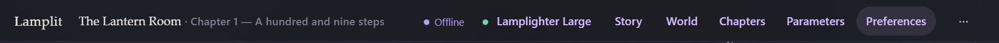

# Your data

[← Documentation](README.md) · Previous: [Models and parameters](models-and-parameters.md) · Next: [The desktop app](desktop.md)

---

Your stories are files. Not rows in a database, not a blob in browser storage, not an export you
have to remember to take — files, in a folder, that you can read in any text editor and copy with
your mouse.

## Where they are

Next to whatever you started, in a folder called `data`:

```
data/
  settings.json              your connection, parameters and reading preferences
  lastRun.json               which version ran here last — see Upgrading
  stories/
    <id>.json                one story: mode, persona, cast, world, lore
  chapters/
    <id>.json                one chapter: its scene, its messages, its summary
backups/
  data-2026-09-03.zip        one per day, taken when the server starts
```

`lastRun.json` is the only file here the app writes for itself rather than for you: it is how a
newer version knows it is newer, and it is written on every start. Deleting it costs nothing but
one upgrade notice. Everything else is your writing.

Running from the repo, that is the repo root. Running an unzipped build, it is beside `start.bat`.
Either way, `--data D:\somewhere` or `LAMPLIT_DATA_DIR` moves it. The
[desktop app](desktop.md) is the one exception: it keeps the same folder in your profile instead,
and **File → Open data folder** takes you to it.

Every document is pretty-printed JSON with a trailing newline, so `git init` in your `data` folder
is a perfectly reasonable way to get version history for a novel.

## How saving works

There is no Save button anywhere in the app, because there is nothing to save — writes happen as
you type.

Underneath: the app reads every document from the server once, when it starts, and holds them for
as long as the tab is open. Changes go to that copy and to the server; a reload starts again from
disk. **There is exactly one place a document lives**, which is why nothing here has to explain
what happens when two copies disagree.

Writes are debounced and merged per document, one request at a time, so a fast-streaming answer
does not turn into a thousand of them. On disk, each one goes to a temporary file that is then
renamed over the target — so a reader sees the old document or the new one, never half of one, and
a crash mid-write leaves the previous version intact.

## When the server is not there



If the server stops answering, an **Offline** button appears in the top bar. That is the only time
the backend is visible at all.

Nothing stops. You keep writing, the model keeps answering, and everything is queued. The app
retries on its own with a widening delay, and clicking **Offline** retries immediately. When the
server comes back, everything queued is sent and the button disappears.

**Do not reload while it says Offline.** The tab holds the only copy of what has not been sent
yet, and a reload starts again from disk. The app tries to stop you if you close the tab with a
failing queue, and it sends one last request per document on the way out.

### Two tabs

Both read from the server when they start, and both write to it. Edits in one show up when the
other reloads, last write wins, and no file is ever left half-written — the server applies writes
to a document one at a time, and ignores any that arrive out of order.

### With no server at all

The app does not start. It says so, and offers to try again.

That is deliberate. Your stories are on disk and the app is a window onto them; an app that opened
anyway would be an empty one, indistinguishable from a fresh install, and the first thing you
typed would be written over a story that was perfectly fine.

## Backups

When the server starts, it zips `data/` into `backups/data-<date>.zip`, once per day, keeping the
last fourteen. It is cheap insurance against a mistake made inside the app — the stores overwrite
documents happily, and nothing else on your machine holds a second copy.

`LAMPLIT_BACKUP=0` turns it off. `LAMPLIT_BACKUP_DIR` moves it.

## Moving, copying, sharing

- **Move it all** — copy the whole folder (the app *and* `data`) anywhere. Nothing is registered
  with the operating system, and nothing is written outside it.
- **Back it up** — copy `data`. That is everything.
- **Start fresh** — delete `data`. The app makes a new one on the next launch.
- **Reuse a setup** — the story menu's **Duplicate** copies a story and all its chapters, so you
  can start a second run of the same world without touching the first.
- **Send someone a story** — send them the story file and its chapter files. There is no import
  screen; dropping them into their `data` folder is the import.

## A word about your key

It is in `data/settings.json`, in plain text. That is a deliberate choice for a single-user tool
on your own machine: a local file you control beats a secret store you have to unlock every time.

The server listens on `127.0.0.1` only, so nothing else on your network can reach it, and it
authorises no cross-origin request at all — a page open on another port of your own machine cannot
read your stories or your key either. Don't run it on a shared machine, don't put it behind a
public port, and don't commit your `data` folder to a public repo.
